# Seekarr


[](https://ko-fi.com/matthwlabs)

A Flutter app for managing your self-hosted media stack from anywhere.  
Supports **Seerr**, **Radarr**, **Sonarr**, **Lidarr**, and **qBittorrent**.

## Support

If you find Seekarr useful, consider supporting me with a donation — it helps keep the project going!

[](https://ko-fi.com/matthwlabs)

---

## Table of Contents

- [Screenshots](#screenshots)
- [Features](#features)
- [Getting Started](#getting-started)
  - [Prerequisites](#prerequisites)
  - [Installation](#installation)
- [Configuration](#configuration)
- [Platform-specific Install](#platform-specific-install)
- [Architecture](#architecture)
- [Contributing](#contributing)
- [About this project](#about-this-project)
- [License](#license)

---

## Screenshots

### Services
<p align="center">
  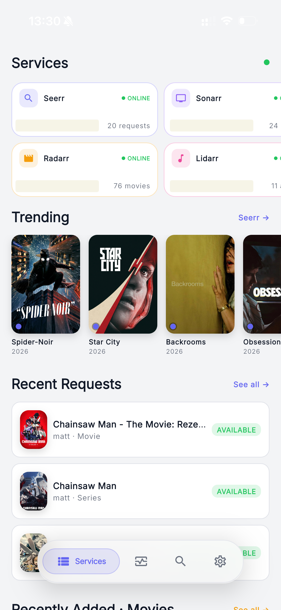
  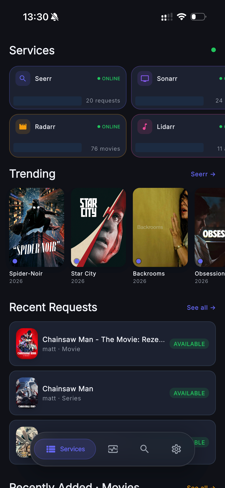
  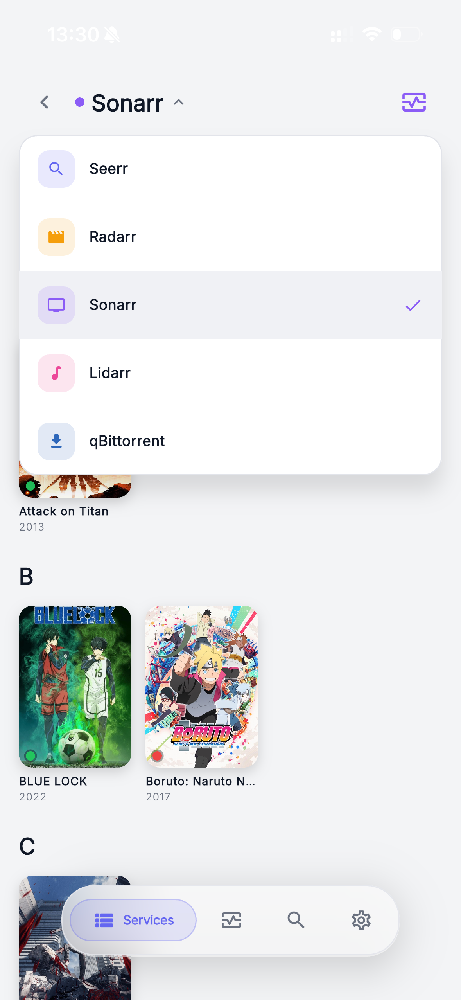
  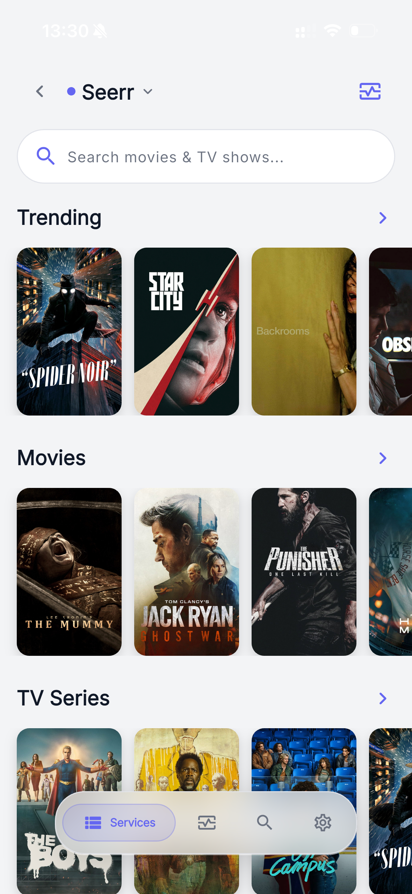
  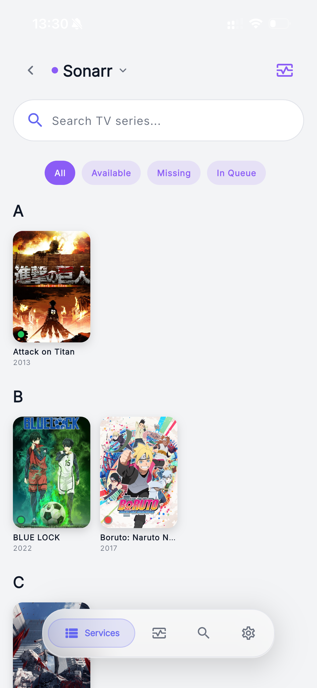
  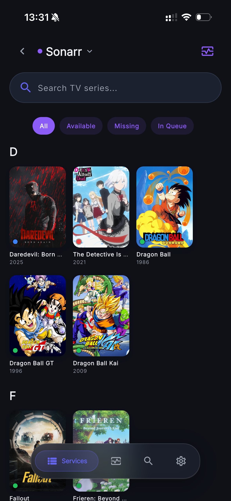
  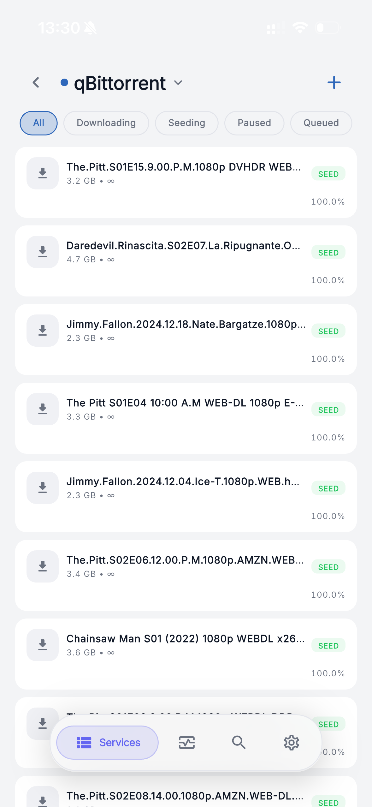
</p>

### Media Details
<p align="center">
  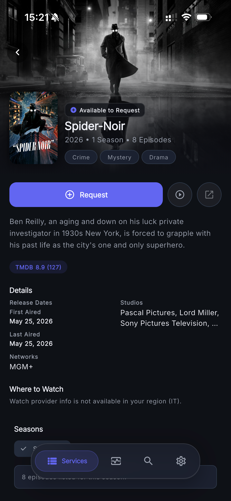
  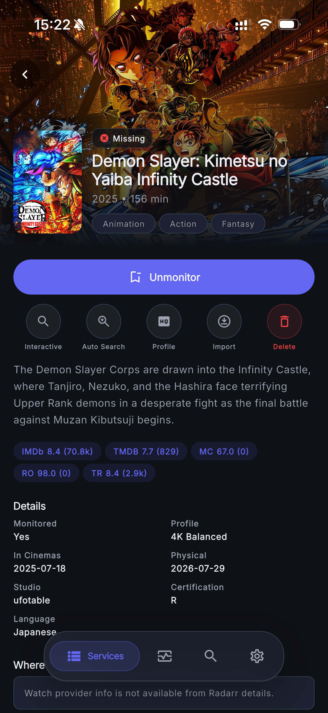
</p>

### Activity Management
<p align="center">
  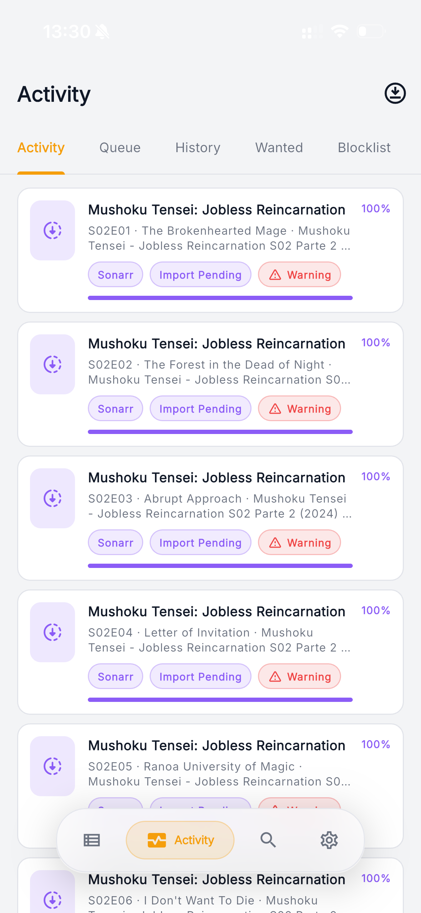
  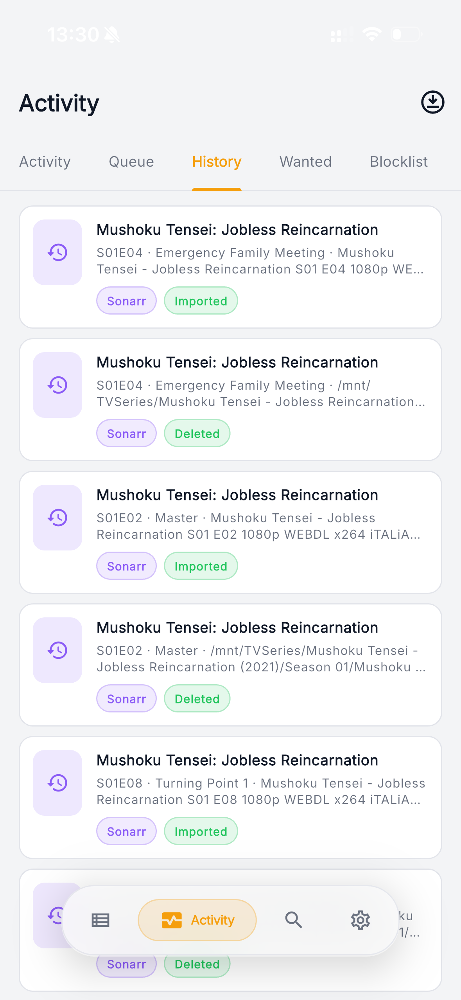
</p>

### Search, Import & Settings
<p align="center">
  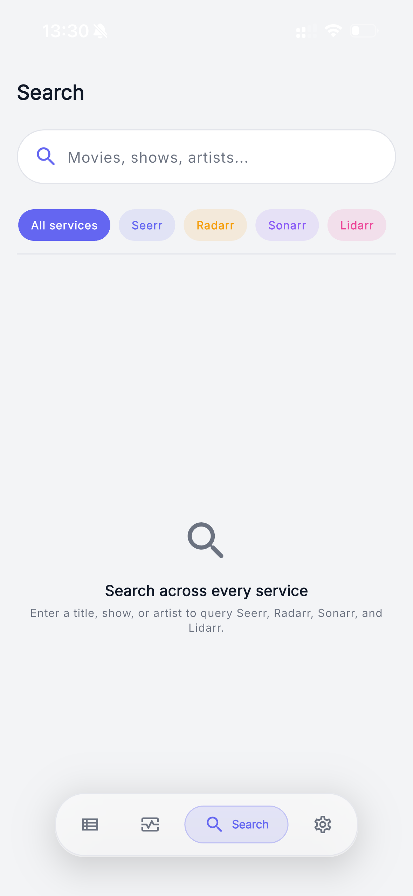
  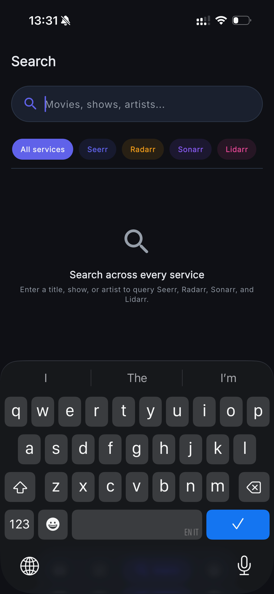
  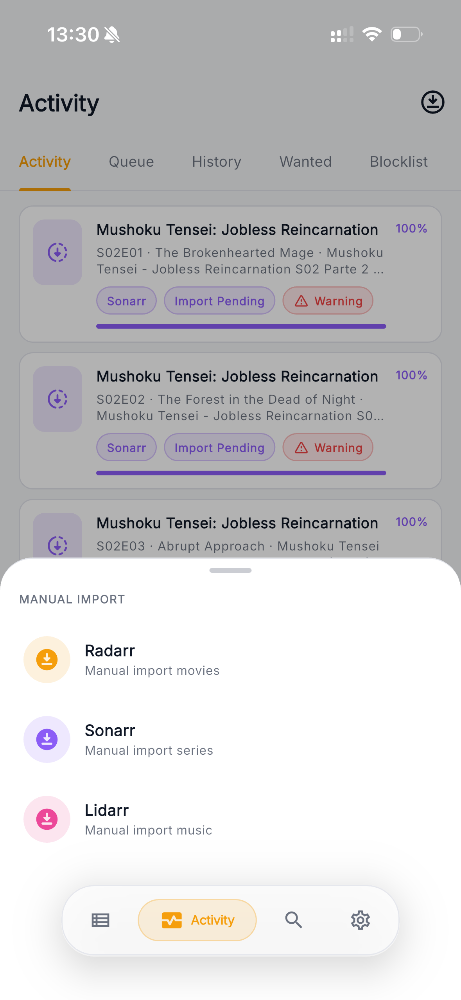
  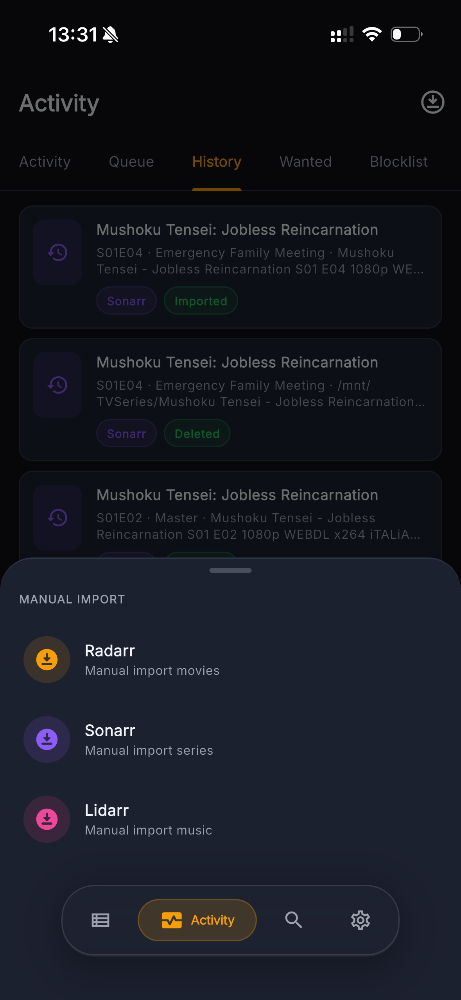
  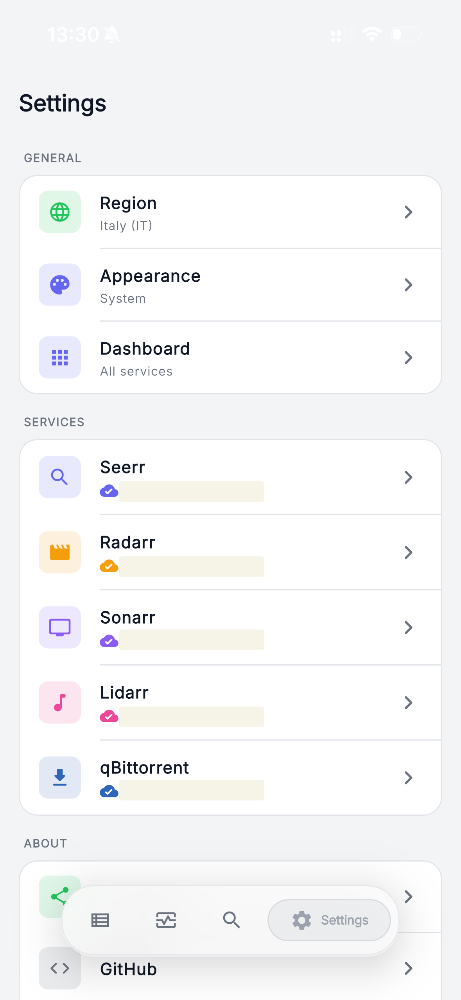
</p>

---

## Features

- **Discover** — Browse trending movies and TV shows via Seerr integration
  - Rich details: backdrops, content ratings, watch providers, trailers, release dates, seasons, collections
  - Manage media: view requests, delete from Radarr/Sonarr, clear data
- **Movies** — View and manage your Radarr movie library
- **TV Series** — View and manage your Sonarr TV series library
- **Music** — View and manage your Lidarr music library
- **Torrents** — Manage qBittorrent torrents from anywhere
  - Filter by status (all / downloading / seeding / completed / paused / queued) plus category, tag, tracker, and free-text sub-filters
  - Detail screen with **Info / Files / Trackers / Actions** tabs and 3s live polling
  - Mutate: pause, resume, force-start, force-recheck, reannounce, set per-torrent speed limits, edit category and tags, delete (with optional file removal)
- **Search** — Cross-service search with always-visible search bars
- **Activity** — Comprehensive task monitoring
  - Queue, History, and Blocklist with sticky segmented navigation and full pagination
  - Wanted: Missing and Cutoff Unmet with status text and pagination
  - Queue status normalization based on structured fields
  - Sonarr wanted items organized by Series → Season → Episode with per-episode search
- **Customization** — Light, Dark, or System theme; configurable navigation bar services
- **Multiplatform** — Tested on Android, iOS, and macOS
- **Material Design 3** — Dynamic color support with a Seerr-inspired palette

---

## Getting Started

### Prerequisites

- Flutter SDK compatible with Dart `^3.10.0`
- For **iOS / macOS**: Xcode
- For **Android**: Android Studio and the Android SDK
- At least one running self-hosted service: Seerr, Radarr, Sonarr, Lidarr, or qBittorrent

### Installation

```bash
git clone https://github.com/your-username/seekarr.git
cd seekarr
flutter pub get
flutter run
```

> Replace `your-username/seekarr` with the actual repository path.

---

## Configuration

Seekarr ships with no default credentials. After launching the app, open **Settings** and configure each service you want to use:

- **Seerr** — Base URL + API key
- **Radarr** — Base URL + API key
- **Sonarr** — Base URL + API key
- **Lidarr** — Base URL + API key
- **qBittorrent** — Base URL + Username + Password (uses qB's WebUI v2 form login; no API key)
- Region preferences (where applicable)

API keys are stored securely on the device using `flutter_secure_storage` and are never transmitted outside your local network.

---

## Platform-specific Install

### Android
Download the `.apk` file from the [Releases](../../releases) page.

### macOS
Download the `.dmg` file from the [Releases](../../releases) page.

### iOS
No pre-built distribution is currently available for iOS. Build and install directly from source:

```bash
flutter build ios --no-codesign
```

Then open the resulting `.app` in Xcode and run it on your device or simulator.

### Web, Linux, Windows
Project scaffolding for these platforms exists, but they are **not officially tested or supported**.  
Contributions to improve support on these platforms are welcome.

---

## Architecture

Seekarr follows a **feature-first layered architecture**:

```
lib/
├── core/           # Shared infrastructure: theme, routing, API client, reusable widgets
└── features/
    ├── <feature>/
    │   ├── data/         # Services and API calls
    │   ├── domain/       # Models
    │   └── presentation/ # Screens, providers, widgets
    ├── activity/
    ├── discover/
    ├── movies/
    ├── music/
    ├── qbittorrent/
    ├── search/
    ├── series/
    └── settings/
```

**Key technical choices:**

| Concern          | Library                  |
| ---------------- | ------------------------ |
| UI framework     | Flutter 3.x + Material 3 |
| State management | Riverpod                 |
| Navigation       | go_router                |
| HTTP             | Dio                      |
| Image caching    | cached_network_image     |
| Dynamic color    | dynamic_color            |
| Secure storage   | flutter_secure_storage   |

**Goals:** readability, modularity, and reusable UI components built on a consistent design token system (`AppSpacing`, `AppRadius`, `AppAnimation`).

---

## Contributing

Contributions are very welcome.

If you want to work on a change, please **open an issue first** to discuss scope and direction before implementation. I review PRs and issues in my spare time and will get to them as soon as I can.

For setup notes, conventions, and pull request expectations, see [CONTRIBUTING.md](CONTRIBUTING.md).

---

## About this project

Seekarr was born from a personal need: flawlessly managing a self-hosted *arr stack from a phone, from anywhere. It is developed with heavy use of agentic coding tools (OpenCode + LLMs), with a focus on pushing AI-assisted development to its quality limits — not just shipping fast.

---

## License

This project is licensed under the **[MIT License](LICENSE)**.
